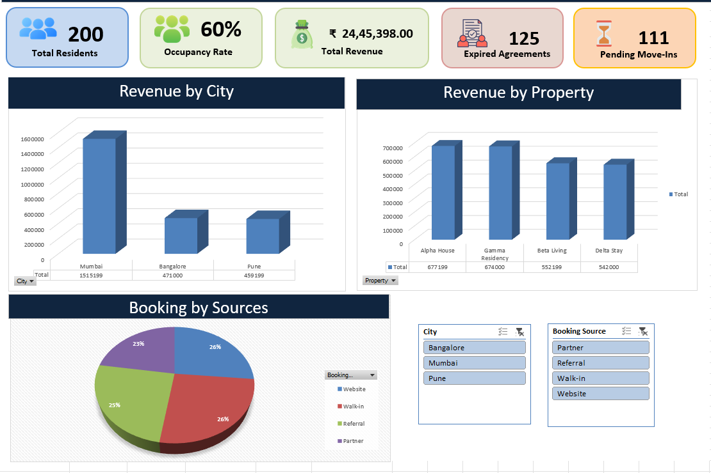
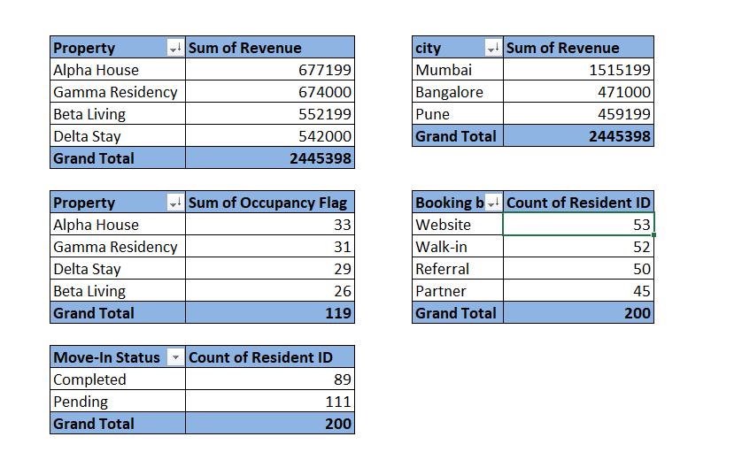
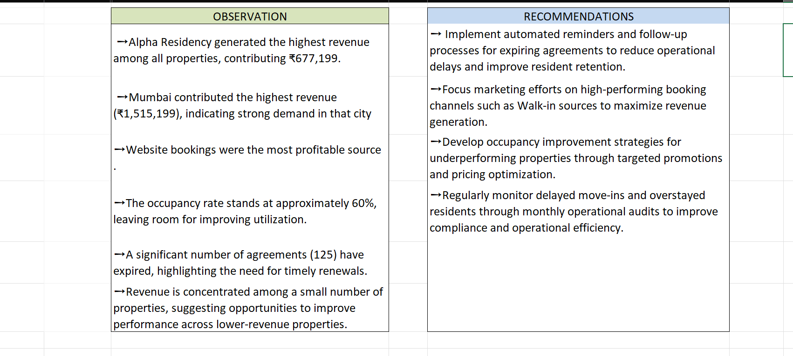

# Resident Management Dashboard

Excel-based Data Analyst project including data cleaning, audit reporting, pivot tables, dashboard creation, and business insights.

## Tools Used
- Microsoft Excel
- Pivot Tables
- Charts
- Slicers
- Data Cleaning
- KPI Cards

## Project Features
✅ Data Cleaning

✅ Audit Report

✅ Formula Assessment

✅ Pivot Tables

✅ Dashboard with KPIs and Charts

✅ Business Insights and Recommendations

## Dashboard

## Pivot Tables

## Analysis Answers

## KPIs
- Total Residents: 200
- Occupancy Rate: 60%
- Total Revenue: ₹24,45,398
- Expired Agreements: 125
- Pending Move-ins: 111
